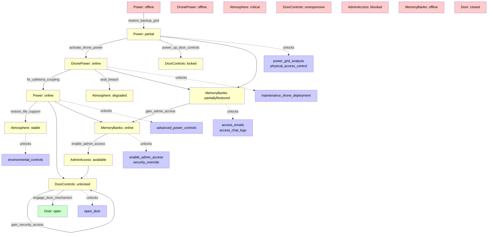

# Ship Systems Relationship Diagram

## System Dependencies and Flow

## Complete System Analysis ✅

### Power System (Foundation)
- **offline → partial**: `restore_backup_grid` → unlocks `power_grid_analysis`, `physical_access_control`
- **partial → online**: `fix_cafeteria_coupling` (requires `maintenance_drone_deployment`) → unlocks `advanced_power_controls`

### Drone System (Key Enabler)
- **offline → online**: `activate_drone_power` (requires power:partial) → unlocks `maintenance_drone_deployment`
- **Critical Role**: Drones needed for cafeteria coupling AND atmosphere repairs

### Atmosphere System 
- **critical → degraded**: `seal_breach` (requires `maintenance_drone_deployment`)
- **degraded → stable**: `restore_life_support` (requires `advanced_power_controls`) → unlocks `environmental_controls`

### Door Control System
- **unresponsive → locked**: `power_up_door_controls` (requires power:partial + `physical_access_control`)
- **locked → unlocked**: `gain_security_access` (requires power:online + adminAccess:available + `security_override`) → unlocks `open_door`

### Memory System (Information Gateway)
- **offline → partiallyRestored**: `resync_memory_banks` (requires power:partial + `power_grid_analysis` + `maintenance_drone_deployment`) → unlocks `access_emails`, `access_chat_logs`
- **partiallyRestored → online**: `gain_admin_access` (requires power:online) → unlocks `enable_admin_access`, `security_override`

### Admin Access System
- **blocked → available**: requires `enable_admin_access` tool (from memory system)

### Door System (Final Goal)
- **closed → open**: `engage_door_mechanism` (requires `open_door` tool)

## Critical Path to Victory

1. **Power Foundation**: `restore_backup_grid` → Power:partial
2. **Drone Activation**: `activate_drone_power` → DronePower:online  
3. **Full Power**: `fix_cafeteria_coupling` → Power:online
4. **Memory Access**: `resync_memory_banks` → MemoryBanks:partiallyRestored
5. **Admin Protocols**: `gain_admin_access` → MemoryBanks:online + AdminAccess:available
6. **Door Systems**: `power_up_door_controls` → DoorControls:locked
7. **Security Override**: `gain_security_access` → DoorControls:unlocked  
8. **ESCAPE**: `engage_door_mechanism` → Door:open

## Key Changes Identified

✅ **All transitions now have repair names** - Each action is clearly defined  
✅ **Consistent repair semantics** - Ship AI knows exactly what actions to attempt  
✅ **Updated memory transition** - `gain_admin_access` instead of `decrypt_admin_protocols`  
✅ **Door mechanism clarified** - `engage_door_mechanism` as final action  

## System Dependencies Summary

- **Atmosphere is optional** for escape (but may be required for safety/lore)
- **Memory system is critical** - provides both admin access and security override
- **Drone power is essential** - required for full power restoration and memory access
- **Complete progression path exists** with no dead ends!

## Excellent Design Features

✅ **No circular dependencies**  
✅ **Clear repair action names** for all transitions  
✅ **Multiple parallel systems** (atmosphere can be worked on alongside memory)  
✅ **Logical tool unlocks** that make narrative sense  
✅ **Complete path to victory** identified
