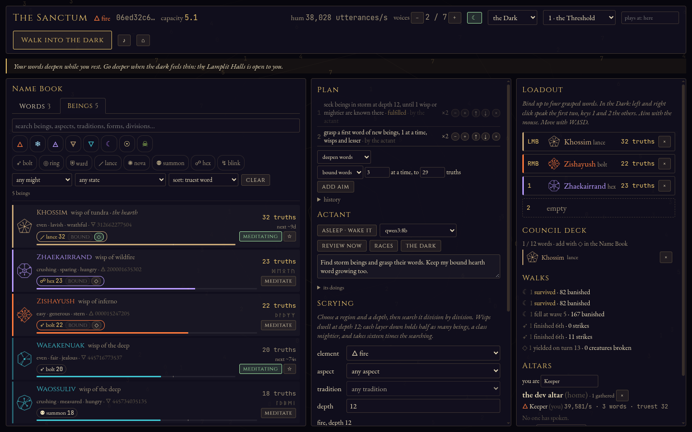
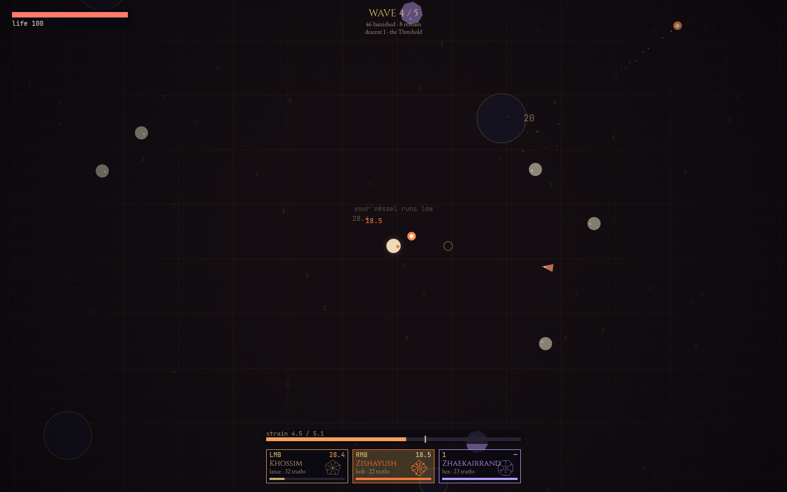
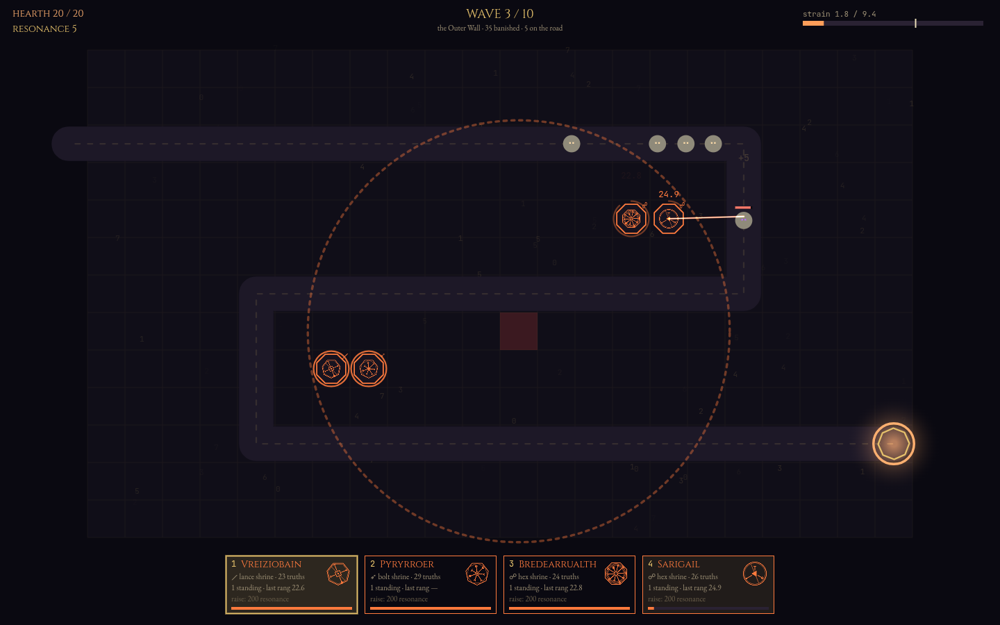
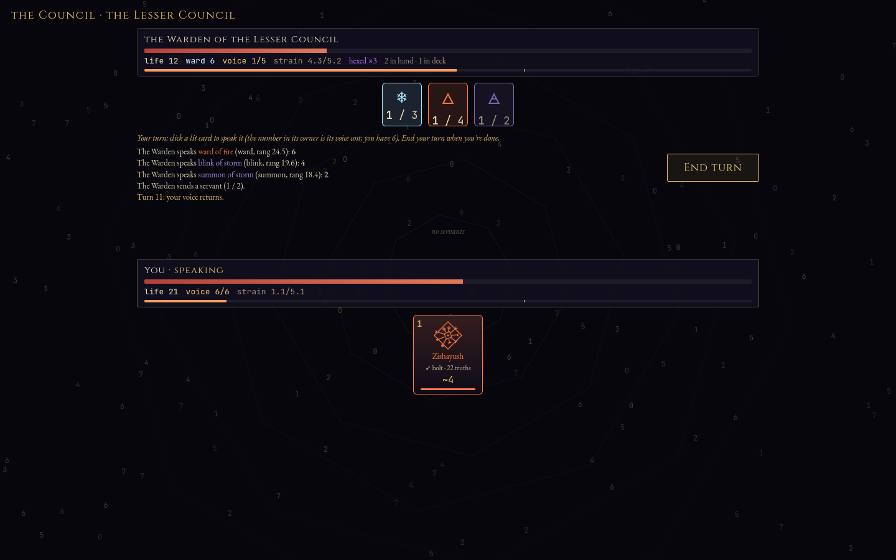
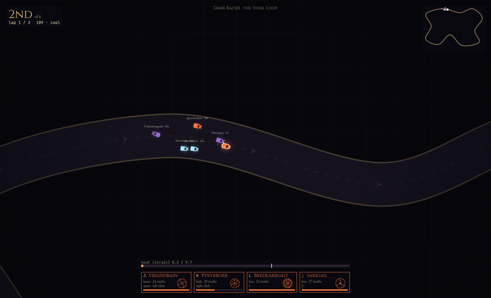

# Truenames

*A spell-casting roguelite where the work is the magic.*

Beings dwell in the eightfold astral, a space that divides into eight, then eight again, forever: wisps in the shallows, half as many and a class mightier at each layer down, gods far below, primordials perhaps only in rumor. To **find** a being is to search that space. To **know** one is to meditate until its **words of power** come to you, one facet at a time, as spoken by you. Both are real computation done by your machine, so the effort it spends is literally your character's strength. Then you carry the words you've grasped into the worlds, and the worlds learn what they can do without ever learning where their beings dwell.



**Status:** playable, on universe spec v2 (the pyramid of might and words of power, 2026-10-01). Four worlds over one power system; words cross into them as zero-knowledge proofs, worlds run in a separate dungeon process, and Dark Racer races are shared between players. The sanctum is still local to your browser. Next: a desktop app with no central server, then AI choir members (actants). Built from 2026-09-27; see the [journal](docs/journal.md).

## How it works
```
 your browser                                        the dungeon (its own process)
┌────────────────────────────────────┐              ┌───────────────────────────────────┐
│ SANCTUM: the astral and its truths │  proofs only │ WORLD: the Dark, the Bastion, …   │
│  scry for beings                   │ ───────────▶ │  verifies each proof, then runs   │
│  meditate words of power           │  (no address,│  the world authoritatively        │
│  keeps every secret                │   no nonce,  │                                   │
│                                    │   no being   │                                   │
│ THIN CLIENT: predicts your moves,  │   identity)  │                                   │
│ draws the dungeon's snapshots      │ ◀─────────── │  snapshots at 20 Hz               │
└────────────────────────────────────┘              └───────────────────────────────────┘
```
- **Everything is derived.** The universe is a pure function of a public seed (Poseidon hashes over an infinite octree). Nothing about beings is stored; only the player's words (signed claims) are.
- **At the threshold** the sanctum proves each bound word in zero knowledge: *"I hold a word of at least N truths for facet F of a being of might M, with this element, this form and these traits."* The dungeon learns the details, never the source. It can't tell which being you carry or where it dwells, and can't link it across rounds.
- **The dungeon is authoritative.** The browser sends only intent (movement, aim, casts), predicts its own movement with the dungeon's own code, and draws everything else slightly in the past between snapshots.

### Worlds
The dungeon hosts several **worlds**, each a different game built on the same proven powers. Pick one in the sanctum's top bar; each has its own descents.
- **The Dark**: an arena. You walk in and speak your four words yourself: five waves and a Warden.
- **The Bastion**: tower defense. Each word becomes a **shrine** along the road to your hearth, and its form decides what the shrine does (bolts, pulses, slowing wards, piercing lances, artillery novas, road guardians, hexes, or throwing foes back). Every shrine speaks in *your* voice, so every shrine strains *you*, and shrines to the same patron share one vessel.
- **The Council**: a turn-based card duel. You build a **deck of up to 12 proven words**, apart from your four-word loadout, and each word is a card. **Voice** grows by one each turn, and words of mightier beings cost more of it. Forms become card effects (bolts strike, rings sweep the table, wards shield, lances pierce, novas gather for a turn, summons send servants, hexes linger, blinks draw). The Warden sits as your peer, speaking charted beings' words at about your deck's resonance, so the duel is won by play, not by raw strength.

- **Dark Racer**: a top-down race against five rivals, three laps round a road through the astral. Your four words are what your car can do (seeking bolts, shockwaves, wards, lances that slow, mines, hunting servants, slicks, and blinking down the road). **Strain is engine heat**: every word you speak lowers your top speed until it ebbs, and backlash spins you out. Make the podium to open the next circuit. **Race your friends**: anyone who takes the starting line at the same circuit within about 15 seconds lands on the same grid, taking a rival's place. Press Enter at the line to go early. `corepack pnpm racer-bot` puts a bot racer on the grid if you want to try it alone.






## Desktop app
```bash
corepack pnpm install
corepack pnpm desktop        # build and run the desktop app (the game and its dungeon in one window)
corepack pnpm desktop:dist   # make apps/desktop/release/Truenames-*.AppImage and *.tar.gz
```
No server needed: each copy hosts its own worlds, and friends on your LAN can join them (type their address in the sanctum's **worlds** field; yours is shown in its hover help). Ubuntu 24.04 needs `sudo apt install libfuse2` for the AppImage; the tar.gz runs anywhere (extract, run `truenames`). `--profile=<name>` runs a separate identity with its own save.

## Play
```sh
corepack pnpm install
corepack pnpm dev        # game → http://localhost:5190/ and the dungeon process on ws://localhost:5192
```
pnpm is used through corepack (no global install needed). Your save lives in your browser's IndexedDB.

1. **Choose an element and attune.** Your first word is spoken to the hearth, *Khossim*, a wisp; meditation finds it in a couple of minutes.
2. **In the sanctum:**
   - **Scry** regions of the astral for beings: wisps at depth 12 (a few minutes each), spirits at 13, powers at 14… a god at 16 is a lifetime's search.
   - **Meditate** on a being: words come to its facets as they will. Each truth requires twice as much meditation as the last, and a word is grasped at its being's bar (22 truths for a wisp, 4 more per class of might).
   - **Bind** four words. Drag one onto a slot, or use *bind*.
3. **Choose a world** and go: the Dark, the Bastion, the Council or Dark Racer.

| Control | |
|---|---|
| WASD | move |
| mouse | aim |
| left / right click | speak the first two words |
| 1 / 2 | speak the other two |
| Esc | pause |
| M | mute |

- Every evocation strains your aura. Spamming weakens every word, and overreaching invites backlash.
- At the threshold your bound words are proven in zero knowledge (~2 s each); the dungeon then weighs them.
- Meditation keeps working in the background, even while you fight; what it unveils counts on your next journey. Win a descent to open the next.

Hover over almost anything for an explanation.

## Develop
```sh
corepack pnpm dev            # game (:5190) + dungeon (:5192) together; add ?lag=150 to the URL to feel simulated latency
corepack pnpm test           # Node: universe vectors, authority, meditation, WASM kernel, proofs, dungeon, prediction
corepack pnpm test:browser   # golden vectors inside a headless-Chromium Web Worker
corepack pnpm typecheck
corepack pnpm build          # static build → apps/game/dist
corepack pnpm tools bench | bench-wasm | sim | god-finder [prefix|-] [depth] | gen-wasm | zk-build
```

```
packages/universe     the frozen, deterministic world: Poseidon hashing, cells, beings, facets, words, claims
packages/authority    the rules: per-caster vessels, strain, capacity, ticks
packages/proofs       zero-knowledge word claims (circom circuit, snarkjs prove/verify)
packages/meditation   scrying and word-grinding workers, scheduling, WASM Poseidon kernel
packages/protocol     shared message types
packages/dungeon      the authoritative round simulation and its wire protocol
apps/game             the browser: sanctum (holds secrets) + thin client for rounds (Vite + Canvas 2D)
apps/dungeon          the dungeon process: WebSocket host for rounds (Node)
apps/tools            CLI tools for benchmarking, simulation and spec work
```
Read [CLAUDE.md](CLAUDE.md) before touching `packages/universe`: its hash spec is frozen, and changing it changes every spirit in existence.

## Docs
| # | Doc | What it covers |
|---|-----|----------------|
| 01 | [Vision](docs/01-vision.md) | Pitch, pillars, core loop, the two axes of power |
| 02 | [Worldbuilding](docs/02-worldbuilding.md) | The astral, beings and their facets, signs, words of power, vessels, the threshold, the worlds; world ↔ mechanic table |
| 03 | [Mechanics](docs/03-mechanics.md) | Glossary and every formula as it runs today: scrying, naming, vessels, casts, strain, capacity, forms per world, ladders |
| 04 | [Universe spec](docs/04-universe-spec.md) | Exact hashing, cell encoding, trait decoding, claims, the zero-knowledge claim (frozen, v1) |
| 05 | [Overview](docs/05-overview.md) | What the game is today: sanctum, worlds, in-world words ↔ mechanics, numbers |
| 06 | [Architecture](docs/06-architecture.md) | Code layout, the threshold, the dungeon process, prediction, shared races, persistence, testing, extending |
| 07 | [Roadmap](docs/07-roadmap.md) | One sanctum, many worlds; principles; done and next |
| 08 | [Open questions](docs/08-open-questions.md) | What's under discussion, undecided, parked and settled |
| — | [Journal](docs/journal.md) | Build log: every decision, measurement and tradeoff |

New here? Read 01 for the idea, 05 for what exists, and 06 for how it's built. The design docs describe the game *as it is*; when the game changes, they change in the same commit.
