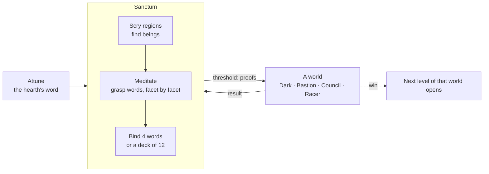

# 05 · Overview

What Truenames **is today**: the game a player meets, and the in-world words for what's underneath. Formulas are in [03](03-mechanics.md), code in [06](06-architecture.md), and the [journal](journal.md) says why things are the way they are.

## The game in one paragraph
You are an apprentice who knows one word of power: the hearth's. In the **sanctum** you *scry* the eightfold astral for beings (wisps in the shallows, gods far below) and *meditate* to grasp their words, one facet at a time. Both are real computation run by your browser, and the result of that work is your character's strength. You bind grasped words and set out into one of four **worlds**: the Dark (an arena), the Bastion (tower defense), the Council (a card duel) or Dark Racer (a race, against rivals and other players). At the **threshold** the sanctum proves each word in zero knowledge; the world receives only those proofs, never where the beings dwell, and each patron lends you a **vessel** of power for the journey. Truer words draw more and strain less; words of mightier beings draw far more. Fall, meditate, return truer, and go deeper.

## The loop

Meditation and scrying never pause for screens. They run in background workers the whole time the page is open. Words are locked in at the threshold, so a word that grows truer mid-journey counts next time.

## Words the player sees, and what they are
The player only ever sees in-world language. The rule (from Robby) is that no implementation units reach the screen: no bits, hashes, pixels or cores.

| On screen | What it is underneath |
|---|---|
| **astral**, **division**, **depth** | An octree of cells addressed by octal paths (`0373116`). Depth = path length. |
| **element / aspect / tradition** | Path digits 1, 2 and 3–4 (fire/magma/the Carved Circle). |
| **being** (wisp, spirit, power, dominion, god…) | A cell at depth ≥ 12 whose Poseidon *spirit hash* clears `4·depth − 26` bits. |
| **might** | `depth − 12`, plus a class for every 4 surplus bits (1 in 16 beings dwell a class above their kind). |
| **sign** | A being's address, as handed down. |
| **facets** and their **forms** | might + 1 facets; their forms, weight, generosity, temper are bits of a second hash (the *trait hash*). Fixed forever, the same for everyone. |
| a being's public name, seal (sigil) | Leftover trait-hash bits: display only. |
| **aura** | An ed25519 keypair. The public key is the aura; the secret key signs claims. |
| **your word** for a facet | A nonce such that `Poseidon(being, aura, nonce)` scores well; its low bits pick the facet. Personal: it includes your key. |
| **truths** | That score: *difficulty bits* of the word's hash. Each truth requires twice as much meditation to unveil. |
| **grasped**, the **bar** | A word holding ≥ `22 + 4·might` truths. |
| **resonance** | Truths beyond the bar. |
| runes | Cosmetic glyphs drawn from your nonce. They change when your word gets truer. |
| **meditation**, **utterances**, **the hum** | Nonce grinding in Web Workers, and its hash rate. |
| **scrying** | Enumerating cells under a prefix and checking each for a spirit. |
| **voices** | Number of active workers. |
| **vessel** | The power a patron lends you for one journey: a per-caster token bucket, shared by that being's words. Size and refill grow ×4 per class of might. Never shared with anyone else. |
| **the threshold** | Where the sanctum proves your bound names (Groth16 over Poseidon) against a round's fresh context. |
| **strain / capacity / backlash** | Aura-global fatigue that subtracts from your effective truths; the ceiling before recoil. |
| **descent** | Difficulty level of a run. |

## Systems in the build

### Sanctum
- **Name Book** (the codex):
  - **Words** tab (beings with a grasped word) and **Beings** tab (everything found). Each row lists the being's facets: their forms, your word's truths, and bind / ◇ (Council deck) on grasped words.
  - Filters: search, element, form, might, state; plus seven sorts.
  - Compact rows with meditate / ★ focus / bind. Drag a name onto a slot to bind it.
  - Click a seal for the **being's card**: facets, bar, vessel size, draw and strain by truth level.
- **Scrying**: pick element / aspect / tradition and a depth (12 for wisps, 13 spirits, … 16 gods).
  - It tells you how big the layer is, how many spirits to expect, how much you've searched and how long the rest takes.
  - The **Chart of the astral** shows coverage for every element × aspect at depths 12–17. Click a cell to aim there.
- **Loadout**: four slots for words, LMB · RMB · key 1 · key 2. **Council deck**: up to 12 words, toggled with ◇ in the Name Book.
- **Top bar**: capacity, hum, voices (worker count), **world** picker, level picker (each world has its own ladder), mute.
- **Guidance line**: reads your save and suggests the next step.
- **Hover help on nearly everything** (`help.ts`).

### The Dark (the first world)
- **Arena**: 2000×1400 world units, pillars for cover, and a camera that follows you. Off-screen enemies show as arrows at the edges.
- **Waves**: five of them. Husks, runners and brutes rush you. **Shamans** (from wave 3) hold synthetic words on the hearth or a charted being and cast through the same authority, each drawing from its own vessel.
- **The Warden** closes wave 5. It holds a strong word on the mightiest charted beings and calls down telegraphed novas.
- **Eight forms**: bolt, ring, ward, lance, nova, summon, hex, blink. Each evocation is a `CastIntent` resolved on the next 200 ms authority tick. The floating number is how true it rang, after strain.
- **Strain** is the only limiter; there are no cooldowns. Spamming lowers total output, and past capacity you risk backlash (recoil damage).
- **Descents**: winning opens the next. Each descent means ×1.7 enemy life, ×1.2 damage, +15% count, and shamans 2 truths truer. It's the counterweight to exponential word growth.

### Feel
- Procedural seals per spirit.
- Fully synthesized audio: the meditation drone swells with the hum, casts are pitched by element, and finds ring bells.
- A darkness vignette, per-descent tint and drifting octal motes.
- "While you were away" summary, and news in the tab title while the tab is hidden.

## Changes from the original plan
The first design (v0 plan, 2026-09-27) is in git history and the journal. What changed on the way:

| Plan said | Build does | Why |
|---|---|---|
| `MIN_NAME_BITS = 8` | 12 (v1), then a bar of 22 + 4·might (v2) | 8 was instant; v2 makes grasping a word scale with the being. |
| depth sets cost only; one name per spirit | the pyramid of might; several words per being (v2) | Robby's model: wisps in the shallows, primordials in the deep; mightier beings broader as well as stronger. |
| cast cap on absolute effective | relative to `capRef = 12` | Absolute made caps enormous with 12-truth names. |
| `strainDecay 0.8`, `capBase 3` | 0.9, 4 | With 0.8, spamming was optimal. |
| shrines (M5) | removed | They duplicated sanctum scrying and added nothing in play. |
| shared wells (per-spirit pools, water-fill contention) | per-caster **vessels** | Proofs grant, never restrict; per-player borrowed power fits the multiplayer split. See [07](07-roadmap.md). |
| clear-text name claims to the game | **zero-knowledge proofs** at the threshold | The game never learns where spirits dwell. |
| PixiJS / Phaser | Canvas 2D + DOM | Circles and glows; an engine added weight without benefit. |
| 4–6 loadout slots | 4 (mouse ×2, keys ×2) | Play feel: the mouse buttons carry the fight. |
| one game (a roguelite) | four worlds over one power system | The sanctum makes power; games interpret it. |
| — | descents, Warden, WASM kernel, codex, dungeon process | See the journal. |

## The threshold (zero knowledge)
- The **sanctum** is the local astral and truth system: it knows the secrets (addresses, nonces, the aura's secret key).
- A **round** (the dark) only ever receives a *journey*: your public aura, and per bound name a zero-knowledge proof bound to that round's fresh context, plus your aura's signature.
- **Prove the details, never the source.** A proof reveals the being's **element** and exact **might**, which **facet** the word is and that facet's **form**, the being's weight, generosity and temper, the **truths** the word clears (a proof may understate, never overstate), a **round tag** that identifies the being within that round only, and the context. It hides the address, the depth, the nonce, and the trait hash, so the dungeon can't tell *which* being you carry, or link it across rounds. Your aura is revealed on purpose: it is your persistent character.
- Your own browser still draws your beings' names and seals; it knows them. The dungeon doesn't.
- Words are **locked in at departure**; meditation that finishes mid-journey counts next time. **Capacity** counts the words you carry in.
- Costs on the dev box: ~2 s to prove a name in a browser worker; up to 3 provers run in parallel, so 4 names take ~7–15 s at the threshold (shown as filling vessels). Verifying takes milliseconds. The circuit is ~22k constraints and proves beings up to depth 24 (and up to 3 classes above their depth).
- The trusted setup is a **local dev ceremony**, fine for single-player, not for a shared world.

## Worlds: one power system, many games
The dungeon hosts several **worlds**. Each admits you by the same proofs and interprets the same names differently. You pick the world in the sanctum's top bar, and each world has its own descent ladder.
- **The Dark**: the arena. You walk in and speak your four words yourself.
- **The Bastion**: tower defense. Each bound word becomes a **shrine type**; its form decides what the shrine does:

  | form | shrine |
  |---|---|
  | bolt | seeking bolts |
  | ring | pulses |
  | ward | a slowing field |
  | lance | a piercing line |
  | nova | delayed artillery |
  | summon | road guardians that block |
  | hex | damage over time |
  | blink | throws a foe back along the road |

  Ten waves walk a winding road to your **hearth**; a Warden comes with the last. **Resonance** from kills and held waves raises shrines, and each costs more than the last. The Dark's rules carry over with new consequences:
  - **Strain is aura-wide.** Every shrine speaks in your name, so every shrine strains you. Too many and every word weakens; past capacity, backlash cracks the hearth.
  - **One vessel per patron.** All shrines to a patron share it, and only one of them speaks per tick, so spreading across patrons pays.
  - Calling a wave early turns the skipped breather into resonance.
- **The Council**: a turn-based card duel against a Warden. It's the reason to hold more than four words: the **deck holds up to 12**, chosen with ◇ in the Name Book, separate from the loadout. Every word in it is proven at the threshold (the provers run in parallel).
  - **Life** is 40 (the Warden gains 8 per seat deeper). **Voice** starts at 1 and grows by one a turn, up to 8. A word costs 1 + its being's might, +1 for summon or nova, so mighty beings come late.
  - **Power** is what the name actually draws when spoken, `round(1.2 × log2(1 + grant × form efficiency))`: about a point per two truths. The same authority judges it: strain (aura-wide, it ebbs between turns), vessels (refilled between turns) and backlash (damages your own face).

    | form | card |
    |---|---|
    | bolt | strike a creature or face |
    | ring | half power to every enemy creature |
    | ward | shield yourself |
    | lance | a creature, with overflow to the face behind |
    | nova | bursts next turn: 1.5× on the face, half on creatures |
    | summon | a servant (toughness = power, attack ≈ ⅓) that strikes each turn |
    | hex | a face over 3 turns, or a creature all at once |
    | blink | draw two, regain a voice |

  - **The Warden is a peer.** It speaks charted beings, its words resonating as far beyond their bars as your deck's median less 3, plus 2 per seat. Strong words don't trivialize the Council the way they do the Bastion. A 40-turn limit ends stalemates as a loss.

- **Dark Racer**: a top-down race, three laps against five AI rivals. WASD or the arrows drive. Your four words are spoken with J K L ; (or space and the mouse buttons, 1 and 2), and each form becomes a racing power:

  | form | on the road |
  |---|---|
  | bolt | a seeking bolt at the car ahead; a hit spins it out |
  | ring | a shockwave that shoves nearby cars |
  | ward | breaks the next strike, slick or shove |
  | lance | a beam ahead; every car it touches is slowed |
  | nova | a mine dropped behind you |
  | summon | a servant that hunts the leader |
  | hex | a slick behind you (no grip) |
  | blink | you reappear further down the road |

  - **Strain is engine heat.** Top speed falls by up to 30% as strain nears capacity, and backlash spins you out. Speaking is the tradeoff: every strike costs pace.
  - **Power** uses the Council's gentle log curve (`1.2 × log2(1 + grant × efficiency)`). Each word has a 1.1 s cooldown, and vessels still limit how much a word draws.
  - **Rivals** are AI cars with their own auras. Each carries two charted beings at their bars (+2 truths per circuit) and drives the shared autopilot, pulling out to overtake. Deeper circuits bring faster rivals and different tracks.
  - **Shared races.** Racers at the same circuit join one race while it gathers: the lobby opens when the first racer is on the grid and holds the start 15 s, longer while someone is still proving (never past 35 s). Enter starts it early. Each player takes a rival's place, proves their own names against the race's context, and gets their own view and result. Someone who leaves is handed to the autopilot.
  - Finish in the **top 3** to open the next circuit. The race ends when you finish, when the podium fills without you, or 25 s after the winner.

## The dungeon is its own process
Worlds are simulated by a separate Node process (the *dungeon*), not the browser. The browser sends intent (movement, aim, casts, plays) and draws what the dungeon reports. The dungeon verifies the proofs, so the browser is never trusted about names. `corepack pnpm dev` starts both. **Dark Racer is the first shared world**: racers at the same circuit within a 15 s lobby share one race. The other worlds are one player per round today.

## Current numbers (dev box: i7-4770, 4 cores / 8 threads)
- Browser hum with 7 workers: ~38k utterances/s (WASM kernel; ~17k with BigInt).
- Scrying (~18k divisions/s): a wisp every ~4 min; a spirit every ~1 h; a god ~a year (solo, nonstop).
- A wisp's first word (22 truths): ~2 min. A power's (30): ~8 h. A god's (38): ~3 months.
- Tests: ~55 in Node (including real proofs), plus golden vectors in a headless-Chromium worker.

## Not built yet
Shared play in the Dark, Bastion and Council; servers as services (grants, deeds, census); the Open Choir; teaching names; warfare and ownership; aura backup/export; mobile/touch. See [07](07-roadmap.md) and [08](08-open-questions.md).
