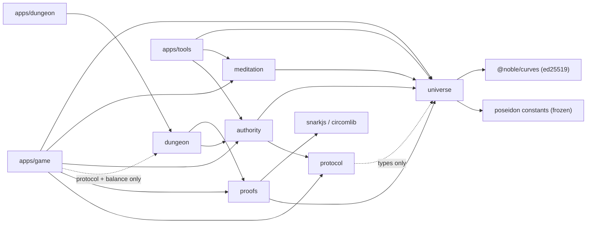
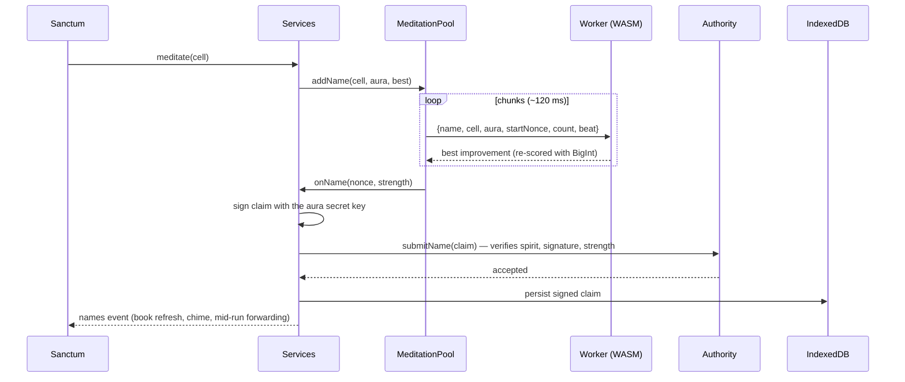
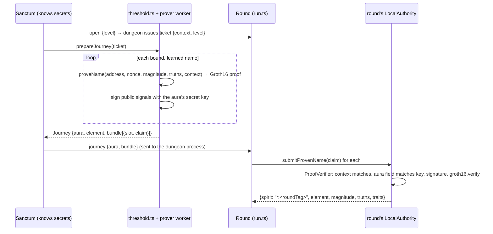
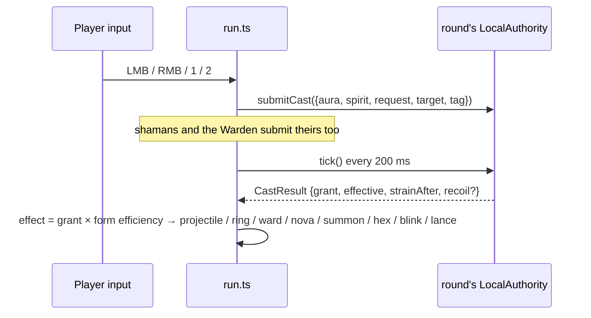

# 06 · Architecture

How the code is organized and how data moves through it. Rules and formulas are in [03](03-mechanics.md); the hashing contract is [04](04-universe-spec.md).

## Layout
```
truenames/
  packages/
    universe/     pure, deterministic spec v1: cells, Poseidon, spirits, traits, names, claims
    protocol/     shared message types: CastIntent, CastResult, TickResult, PoolInfo, AuraState
    authority/    the rules: per-caster vessels, strain, capacity, backlash, ticks; proof-verifier seam
    proofs/       zero-knowledge name claims: circuit generator, build (circom2 + snarkjs), prove, verify
    dungeon/      the authoritative round simulation (pure), wire protocol, balance, public world constants
    meditation/   scry + name-grinding hot loops, worker body, MeditationPool, WASM Poseidon kernel
  apps/
    game/         Vite + Canvas 2D client: the sanctum (holds secrets) and a thin client for dungeon rounds
    dungeon/      Node process: WebSocket host for worlds (a round per connection; shared races for Dark Racer); racer-bot
    tools/        CLI: bench, sim, god-finder, golden vectors, WASM generator, browser vector check
  docs/           vision, world, mechanics, spec (01–04); overview, architecture (05–06); roadmap, open questions (07–08); journal
```
It's a pnpm workspace. Libraries export their TypeScript source directly (`"exports": "./src/index.ts"`), with no build step: Vite, Vitest and tsx consume TS as-is. `tsc --noEmit` is the typecheck.

## Dependency graph

Rules held from [CLAUDE.md](../CLAUDE.md):
1. `universe` is pure and deterministic. It uses BigInt only: no floats in anything that decides existence, magnitude, traits or strength, and no `Math.random` or `Date`.
2. The universe spec is frozen. Golden vectors refuse to regenerate.
3. Vectors pass in Node and in a browser worker (`pnpm test`, `pnpm test:browser`).
4. The authority is an interface, and game code only talks to it through `Authority` / `NpcAuthority`.
5. Name verification sits behind verifiers: the sanctum uses `NameVerifier` (`ClearTextVerifier`), worlds use a `ProofVerifier` (`zkVerifier`).
6. **The game side never sees secrets.** Worlds run in a separate **dungeon process**, which only ever receives proofs. In the browser, the world screens and `round.ts` are a thin client and import nothing from `save.ts`, `services.ts` or `threshold.ts`.
7. Authority tunables live in `packages/authority/src/tunables.ts`. World balance lives in `packages/dungeon/src/balance.ts`.

## packages/universe
One file of rules plus a fast Poseidon.
- `index.ts` holds the spec v1 functions: `bits`, `target`, `cellDigest` (chained, prefix-memoized), `region`, `spiritAt` / `spiritFromDigest`, `decodeTraits`, `auraField`, `nameHash` / `nameStrength`, `signNameClaim` / `verifyNameClaim`, and the constants (`SEED`, `MIN_SPIRIT_DEPTH = 6`, `MIN_NAME_BITS = 12`).
- `poseidon.ts` is a straight-line Poseidon over frozen constants (`poseidon-constants.ts`, extracted from poseidon-lite). It's bit-identical to poseidon-lite, and a test enforces that.
- `test/vectors.json` holds the golden vectors (never regenerated). `test/run-vectors.ts` is the environment-neutral runner used by both Node and the browser.

## packages/authority
`LocalAuthority implements NpcAuthority` (which `extends Authority`):
```ts
registerAura(pub)   submitName(claim) → {accepted, strength}   submitCast(intent)
submitProvenName(zkClaim) → Promise   // needs a ProofVerifier + round context
tick() → TickResult   auraState(aura)   nameBook(aura)   poolInfo(aura, spirit)   currentTick()
grantSyntheticName(aura, cell, strength)   forgetAura(aura)      // NPC seam
```
- **Tick** (`TICK_MS = 200`):
  1. Decay strain.
  2. Take queued casts in order; a second cast by the same aura on the same spirit that tick is refused `duplicate`.
  3. Lazily refill each pool.
  4. Compute effective = strength + bonus − strain.
  5. **Draw from the caster's own vessel**: grant = min(request, cap(effective, generosity), vessel level). Vessels are keyed by aura + spirit; nothing is shared.
  6. Add strain.
  7. Roll backlash on a seeded PRNG.
  8. Emit `CastResult`s.
- **Pools** are created lazily at full level; refill is computed on read. Untouched spirits cost nothing.
- **Capacity** is derived from the name book and cached per aura.
- Pure functions exported for clients and tools: `spiritStats`, `castCap`, `castStrain`, `familiarity`, `capacityOf`.

## packages/meditation
- **`scan.ts`**:
  - `scanRange(prefix, extra, start, count, onHit, kernel?)` walks cells in index (Z) order with a digest stack. Consecutive siblings cost ~1.14 child hashes plus one spirit hash.
  - `grindName(digest, aura, start, count, beat, onBest, kernel?)`.
- **`worker-body.ts`**: `installWorker(self)` answers `WorkChunk` messages. It loads the WASM kernel once, self-tests it against BigInt Poseidon, and falls back to BigInt on failure. Failed chunks are reported back with their range.
- **`pool.ts` (`MeditationPool`)** runs N workers (hardwareConcurrency − 1) and hands out **small chunks** (~120 ms, sized adaptively):
  - **Weighted fair scheduling**: the task with the least `sent / weight` goes next. Focus = weight 4.
  - **Scry tasks** keep a *contiguous frontier* (`doneUpTo`) even though chunks finish out of order. Failed ranges go on a retry list. `extendScry` widens a running task without disturbing in-flight chunks.
  - **Name tasks** start at a random 64-bit nonce and report only improvements.
  - Control: `setActive(n)` (voices), `setPaused`, `rate()` (utterances/s over 3 s).
- **`wasm/`**: the Poseidon kernel.
  - **Generation**: `apps/tools/src/gen-wasm.ts` *generates* the WAT (8×32-bit-limb Montgomery CIOS multiply, fully unrolled), compiles it with `wabt`, and embeds it as base64 in `kernel-bytes.ts`.
  - **Optimization**: `kernel.ts` derives **optimized Poseidon constants** at load: partial-round constants are folded to one scalar, and each partial mix is factored into sparse matrices (Poseidon paper, appendix B).
  - **Trust**: it's an accelerator only. Candidate scry hits are recomputed by the universe, and name improvements are re-scored with BigInt before being reported.

## apps/game
```
main.ts           boot: load save → Services → screens; the rAF loop; audio wake; tooltips; idle summary
services.ts       long-lived: save, MeditationPool, session authority, event emitters (finds, names, scry, hum)
save.ts           IndexedDB persistence (one record), aura keypair, claim signing, world progress
threshold.ts      sanctum side of the threshold: which names a world carries, a pool of prover workers, cosmetics
round.ts          game side: DungeonLink (WebSocket to the dungeon), Journey, RoundHost
screens/
  title.ts        title, element choice, attunement (a real grind on the hearth-god)
  sanctum.ts      top bar (world + level), guidance, scrying, loadout, Council deck, the threshold overlay
  codex.ts        the Name Book: tabs, filters, sorts, compact paginated rows, ◇ deck toggle
  spirit-card.ts  per-spirit card
  chart.ts        Chart of the astral (coverage per element × aspect × depth)
  run.ts          the Dark (thin client: prediction, interpolation, fx, HUD)
  bastion.ts      the Bastion (thin client: placement, shrines, waves)
  council.ts      the Council (DOM table, cards, targeting)
  racer.ts        Dark Racer (thin client: car prediction, road, minimap, lobby)
lore.ts           names, aspects, traditions, forms, tempers, `truths()`
sigil.ts          procedural seals from flavor bits (cached canvases)
help.ts           HELP dictionary + one shared tooltip (DOM `data-tip` and canvas HUD)
audio.ts          synthesized WebAudio (drone, casts, finds, chimes)
astral.ts         menu backdrop
meditation.worker.ts / prover.worker.ts / vectors.worker.ts   worker entry points
```
**Screens** implement `{ mount(ui), unmount(), frame?(dt, ctx, w, h) }`. `main.ts` owns the canvas and the requestAnimationFrame loop. Canvas worlds draw their own frame, and other screens get the astral backdrop. `Services` outlives every screen, which is why meditation never pauses.

## Life of a name

The save stores **signed claims**, not bare numbers. On boot and at the start of each run they're re-submitted and re-verified, exactly as they would be to a server.

## Worlds
`packages/dungeon` holds one simulation per world behind the same host interface (`admit`, `welcome`, `handle`, `start`, `step`, `snapshot`, `over`, `result`, `paused`):
- **`sim.ts` (`DungeonSim`, world `dark`)**: the arena (below).
- **`bastion.ts` (`BastionSim`, world `bastion`)**: tower defense on a tile grid with a polyline road (`BASTION` in `balance.ts`: layout, waves, foes, and per-form shrine behavior). Shrines cast through the same `LocalAuthority` in the player's name: strain is aura-wide, and vessels are per patron and shared by all its shrines (`aura|spirit`); a second same-patron shrine that tick is refused `duplicate` and retries. Messages: `build {slot, gx, gy}`, `sell {id}`, `call`. Snapshots are `bsnap`.
- **`council.ts` (`CouncilSim`, world `council`)**: a turn-based card duel (`COUNCIL` and `councilPower()` in `balance.ts`; the client estimate uses the same function). Two seats: the player, and an AI Warden with synthetic names (`npc:council-warden`). Plays go through `auth.submitCast` + `auth.tick()`; `ticksPerTurn` authority ticks pass between turns. Messages: `play {card, target?}` and `pass`. Views (`cview`) are sent **only when something changed** (turn-based, no stream) and carry the *viewer's* hand only; the opponent's is a count. `admitNames(…, maxSlots)` admits up to 12 names here, and 4 elsewhere.
- **`racer.ts` (`RacerSim`, world `racer`)** and **`racing.ts`** (shared with the client: `buildTrack` (closed Catmull-Rom resampled every 20 units), `driveCar` (arcade physics: world-frame velocity, grip bleeds sideways motion, edges are walls), `autopilot` (rivals and tests), `nearestIndex`/`roadDir`). The client **predicts its own car** with `driveCar` and reconciles against `rsnap` (it carries `ack`), as the Dark does with `movePlayer`. Other cars are interpolated. Messages: `drive {cmds}` (numbered throttle/steer commands) and `cast {slot}`. The track's sampled centerline goes out in the welcome. Casts go through the authority in the caster's aura (rivals have their own); strain sets each car's `top` speed multiplier (heat). Tunables are in `RACER` in `balance.ts`.
  - **Shared races (the first multiplayer):** unlike the other worlds (one round per connection), the server keeps a registry of races. `open {world:'racer'}` joins a race at that circuit that hasn't started and whose lobby is still open, or makes one, and hands out *that race's* context, so every racer's proofs bind to it. `RacerSim` holds six cars from the start (all AI); `admit` gives the rearmost AI car to the player, `viewFor(aura, events)` builds each player's snapshot from one shared `drainEvents()`, `doneFor(aura)`/`result(aura)` end each player's race separately, and `leave(aura)` hands the car to the autopilot. The race loop lives on the race, not the connection; a shared race ignores pause, and `go` starts it early. `apps/dungeon/src/racer-bot.ts` (`corepack pnpm racer-bot [circuit]`) is a bot racer over the real wire.
- **`admission.ts`**: the shared threshold check (verify each proof, refuse duplicates, keep only revealed details).
- The server picks the world from `open {level, world}`. The client picks a screen from `welcome.world` (`screens/run.ts`, `screens/bastion.ts`, `screens/council.ts` or `screens/racer.ts`, all thin clients). Progress is per world in the save (`descent`/`lastDescent` for the Dark, `worlds.bastion`/`worlds.council` for the others; `councilDeck` holds up to 12 cells). The threshold proves the Council deck instead of the loadout, across a small pool of prover workers.

## The dungeon process
- **`packages/dungeon/src/sim.ts` (`DungeonSim`)** is the authoritative round: arena and pillars, waves, enemies (husks, runners, brutes, shamans, the Warden), allies, projectiles, novas, and all eight forms, resolved through a `LocalAuthority` built with the proof verifier and the round's context. It is pure: the host feeds `input`/`cast` and fixed `step(dt)`; it emits `snapshot()`s carrying state plus **events** (casts, hits, kills, beams, rings, novas, banners…). It uses element numbers, never colors; the client owns presentation. It supports several players (enemies take the nearest living one; the round is lost when none live), though one plays today.
- **`apps/dungeon/src/server.ts`** is a Node WebSocket server (port 5192, `DUNGEON_PORT`). Per connection: `open {level}` → `ticket {context}` (fresh 128-bit, from Node crypto) → `journey {aura, bundle}` → proofs verified → `welcome {arena, pillars, slots, refused}` → simulation at 60 Hz with **snapshots at 20 Hz** → `end {result}`. Also `cmds` (numbered movement/aim commands), `cast`, `pause` (single-player convenience), `abandon`.
- **The browser run is a thin client** using the standard model (Valve / Gambetta). It never simulates damage or outcomes.
  - **Client-side prediction:** every client tick (60 Hz) produces a numbered command `{seq, move, aim, dt}`. The client applies it to itself at once with **`packages/dungeon/src/movement.ts: movePlayer`**, the same function the dungeon runs, and sends commands in batches at 30 Hz.
  - **Server reconciliation:** the dungeon applies commands in order and acknowledges the last one per player (`ack` in snapshots). On each snapshot the client resets to the dungeon's position and replays the unacknowledged commands. Small differences are smoothed away (decay 12/s); large ones (a blink) are taken at once.
  - **Anti-speedhack:** each player has a movement budget refilled by real simulation time (capped at 0.25 s), so extra or long commands can't move you faster than time passes.
  - **Entity interpolation:** everything else is drawn 100 ms in the past, between the two snapshots around that moment, on an estimated dungeon clock. World events (hits, kills, novas…) play when the interpolated view reaches them; your own events play at once.
  - **Casts are not predicted** beyond the gathering spark: the rules engine decides grants. Lag compensation (rewinding for hits) is deferred until players fight players.
  - `?lag=150` on the game URL asks the dungeon to simulate that much round-trip latency (dev only).
- `corepack pnpm dev` runs both (`scripts/dev.mjs`, prefixed output); `pnpm game` / `pnpm dungeon` run them alone. `?dungeon=ws://host:port` points the client at another dungeon.

## The threshold (sanctum → round)

- **Circuit** (`packages/proofs/src/gen-circuit.ts` generates `circuits/name.circom`, with constants taken from the universe): secret digits, depth and nonce. Public inputs: aura field, magnitude, strength, context. Outputs: **round tag** (`Poseidon(101, digest, context)`), **element**, and the gameplay **traits** (form, weight, generosity, temper), decoded from the trait hash in-circuit. **The trait hash itself never leaves the proof** (the principle: prove the details, never the source). It checks the chained digest over `depth` digits, `bits(spiritHash) ≥ target(depth) + magnitude`, `bits(nameHash) ≥ strength` (thresholds `P >> k` via a one-hot table and 127-bit limb comparisons), and 6 ≤ depth ≤ 24.
- **Build**: `corepack pnpm tools zk-build` compiles the circuit with circom2 (WASM) and runs a **local dev Groth16 ceremony** (about 9 minutes). The resulting `artifacts/name.wasm`, `name.zkey` and `name.vkey.json` are committed so the game runs without rebuilding. Proofs are per journey, so rebuilding the keys breaks nothing persistent.
- **Spirit ids in a round** are `r:<roundTag>`: unique per spirit within the round (duplicate patrons in a bundle are refused), unlinkable across rounds. Enemy casters use public spirits by address (the ancients), resolved through the universe.
- **Display**: the dungeon never learns a player's spirits' names or seals (they come from the secret flavor bits). The journey carries local-only `cosmetics` so the player's own browser draws its true names; they are never sent to the dungeon.

## Life of a cast

Each round builds its **own** `LocalAuthority` (with the proof verifier and the round's context), so vessels and strain are per round. Your names come only from verified proofs. Enemy casters get synthetic names through `grantSyntheticName` and draw from their own vessels.

## Persistence
There's one IndexedDB record (`truenames` / `kv` / `save`), written with a 1.5 s debounce. It holds:
- the aura (secret key, public key, element)
- known spirits (wire form, source, when found)
- **signed name claims**
- the scan map (`prefix|depth → frontier`)
- the meditation, focus and scry plans (resumed on boot)
- the 4-slot loadout and the Council deck (≤ 12 cells)
- run history (with world), worker count, progress per world (`descent`/`lastDescent` for the Dark, `worlds.{bastion,council,racer}`), the last world picked
- the codex view

The universe itself is never stored; it's recomputed from the seed. Losing the secret key loses every name, and there's no backup/export yet.

## Testing and tools
| Command | What |
|---|---|
| `corepack pnpm test` | Vitest: golden vectors, fast-Poseidon ≡ poseidon-lite, authority invariants (allocation, spam collapse, contention, capacity, lazy pools), scan/grind equivalence, pool scheduling (out-of-order, extend mid-flight, flaky workers), WASM ≡ BigInt (both kernel modes). |
| `corepack pnpm test:browser` | Serves `vectors.html` with Vite and runs the golden vectors in a headless-Chromium Web Worker (`playwright-core` 1.58.2). |
| `corepack pnpm typecheck` | `tsc --noEmit` over all packages and apps. |
| `corepack pnpm tools bench` / `bench-wasm` | Hash rates, BigInt vs WASM. |
| `corepack pnpm tools sim` | Cadence and contention tables for tuning strain and pools. |
| `corepack pnpm tools god-finder [prefix\|-] [depth]` | Parallel scan of a layer, listing spirits by might. |
| `corepack pnpm tools vectors` | Wrote the golden vectors once; refuses to overwrite. |
| `corepack pnpm tools gen-wasm` | Regenerates the WASM kernel. |
| `corepack pnpm tools zk-build` | Regenerates the name circuit and runs the local dev ceremony (~9 min). |
| `corepack pnpm racer-bot [circuit]` | A bot racer over the real wire (own aura, real proof), for testing shared races alone. |

Balance was tuned with scripted Playwright bots playing whole runs at chosen descents (see the journal).

## Extending
- **A new form**: add it to `FORMS` (lore), `formWeight` / `formEfficiency` (tunables), every world's cast switch (`sim.ts: applyPlayerCast`, `bastion.ts`, `council.ts`, `racer.ts: applyCast`), a sound in `audio.ts: sfxCast`, and `FORM_GLYPH` in `codex.ts`. Trait decoding only has 3 bits (8 forms), so a 9th form needs a spec version bump and a new circuit.
- **A new world**: a sim in `packages/dungeon/src` with the host interface (`admit` via `admitNames`, `welcome`, `handle`, `start`, `step`, `snapshot`, `over`, `result`, `paused`), its config in `balance.ts` (`World`, `WORLDS`, `worldDescentName`), its messages and snapshot in `protocol.ts`, a branch in `apps/dungeon/src/server.ts`, a `DungeonLink` handler in `round.ts`, a screen, and its labels/progress in `sanctum.ts` and `save.ts`. Decide how it turns grants into numbers (raw effect, or `logPower`). Then document it in 03, 05 and here.
- **A tunable**: authority rules go in `tunables.ts`; world balance goes in `packages/dungeon/src/balance.ts`. Never inline numbers.
- **A new screen**: implement `Screen` and call `app.go(screen)`. Use `data-tip` with a `HELP` key for hover help.
- **Player-facing text**: in-world words only. Format truths with `lore.truths(n)`.

## Seams for multiplayer
- **Already there**: worlds run in a separate process that trusts only proofs; each world's sim is written for several players (the Dark's enemies take the nearest living player; Dark Racer shares races through a registry in `server.ts`, with per-player views and results). Adding players to another world is mostly a lobby plus per-player views.
- **Sanctum claims** are self-verifying signed records (`truenames/name/v1|cell|nonce`): anyone can grind a name *for* someone else, but only the key holder can sign it. A sanctum service (backup, census, Open Choir) needs no trust in the client.
- **Still local-only**: the whole sanctum (scan map, name book, claims) lives in one browser's IndexedDB; there's no export, no census, no shared knowledge. The dungeon's trusted setup is a local dev ceremony. See [07](07-roadmap.md).
