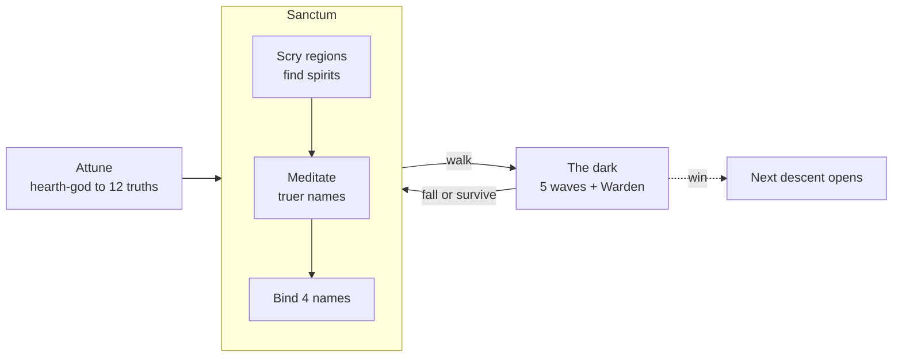

# 09 · Overview (as built)

What Truenames **is today**, as opposed to what the design docs (01–08) planned. Where the build differs from the design, this doc says so and the [journal](journal.md) says why.

## The game in one paragraph
You are an apprentice who knows one word: the name of the hearth-god. In the **sanctum** you *scry* the eightfold astral for spirits and *meditate* to find truer names for the ones you've found. Both are real computation run by your browser, and the result of that work is your character's strength. You bind up to four learned names and **walk into the dark**: a top-down arena of five waves, ending with a Warden. At the **threshold** the sanctum proves each name in zero knowledge; the round receives only those proofs, never where the spirits dwell, and each patron lends you a **vessel** of power for the journey. Truer names draw more and strain less. Fall, meditate, return truer, and walk deeper.

## The loop

Meditation and scrying never pause for screens. They run in background workers the whole time the page is open, including mid-fight, and a name that grows truer mid-fight takes effect immediately.

## Words the player sees, and what they are
The player only ever sees in-world language. The rule (from Robby) is that no implementation units reach the screen: no bits, hashes, pixels or cores.

| On screen | What it is underneath |
|---|---|
| **astral**, **division**, **depth** | An octree of cells addressed by octal paths (`0373116`). Depth = path length. |
| **element / aspect / tradition** | Path digits 1, 2 and 3–4 (fire/magma/the Carved Circle). |
| **spirit** | A cell whose Poseidon *spirit hash* clears a depth-dependent difficulty target. |
| **magnitude** (wisp → primordial) | How far the spirit hash clears the target. Each step is half as common. |
| **form, weight, generosity, temper** | Bits of a second hash of the cell (the *trait hash*). Fixed forever, the same for everyone. |
| spirit's public name, seal (sigil) | Leftover trait-hash bits: display only. |
| **aura** | An ed25519 keypair. The public key is the aura; the secret key signs claims. |
| **your name** for a spirit | A nonce such that `Poseidon(spirit, aura, nonce)` scores well. Personal: it includes your key. |
| **truths** | That score: *difficulty bits* of the name hash. Each truth requires twice as much meditation to unveil. |
| **learned** | A name holding ≥ 12 truths (`MIN_NAME_BITS`). |
| runes | Cosmetic glyphs drawn from your nonce. They change when your name gets truer. |
| **meditation**, **utterances**, **the hum** | Nonce grinding in Web Workers, and its hash rate. |
| **scrying** | Enumerating cells under a prefix and checking each for a spirit. |
| **voices** | Number of active workers. |
| **vessel** | The power a patron lends you for one journey: a per-caster token bucket. Size and refill grow with magnitude. Never shared. |
| **the threshold** | Where the sanctum proves your bound names (Groth16 over Poseidon) against a round's fresh context. |
| **strain / capacity / backlash** | Aura-global fatigue that subtracts from your effective truths; the ceiling before recoil. |
| **descent** | Difficulty level of a run. |

## Systems in the build

### Sanctum
- **Name Book** (the codex):
  - **Names** tab (learned names) and **Spirits** tab (everything found).
  - Filters: search, element, form, might, state; plus seven sorts.
  - Compact rows with meditate / ★ focus / bind. Drag a name onto a slot to bind it.
  - Click a seal for the **spirit card**: traits, vessel size, draw and strain by truth level.
- **Scrying**: pick element / aspect / tradition and a depth.
  - It tells you how big the layer is, how many spirits to expect, how much you've searched and how long the rest takes.
  - The **Chart of the astral** shows coverage for every element × aspect at depths 7–12. Click a cell to aim there.
- **Loadout**: four slots, LMB · RMB · key 1 · key 2.
- **Top bar**: capacity, hum, voices (worker count), descent picker, mute.
- **Guidance line**: reads your save and suggests the next step.
- **Hover help on nearly everything** (`help.ts`).

### The dark (a run)
- **Arena**: 2000×1400 world units, pillars for cover, and a camera that follows you. Off-screen enemies show as arrows at the edges.
- **Waves**: five of them. Husks, runners and brutes rush you. **Shamans** (from wave 3) hold synthetic names on the hearth-god or an ancient spirit and cast through the same authority, each drawing from its own vessel.
- **The Warden** closes wave 5. It holds a strong name on one of the five mightiest ancients and calls down telegraphed novas.
- **Eight forms**: bolt, ring, ward, lance, nova, summon, hex, blink. Each evocation is a `CastIntent` resolved on the next 200 ms authority tick. The floating number is how true it rang, after strain.
- **Strain** is the only limiter; there are no cooldowns. Spamming lowers total output, and past capacity you risk backlash (recoil damage).
- **Descents**: winning opens the next. Each descent means ×1.7 enemy life, ×1.2 damage, +15% count, and shamans 2 truths truer. It's the counterweight to exponential name growth.

### Feel
- Procedural seals per spirit.
- Fully synthesized audio: the meditation drone swells with the hum, casts are pitched by element, and finds ring bells.
- A darkness vignette, per-descent tint and drifting octal motes.
- "While you were away" summary, and news in the tab title while the tab is hidden.

## Deviations from the design docs (summary)
| Design said | Build does | Why |
|---|---|---|
| `MIN_NAME_BITS = 8` | 12 | 8 was instant; 12 makes attunement a moment and aligns with `capThreshold`. |
| cast cap on absolute effective | relative to `capRef = 12` | Absolute made caps enormous with 12-truth names. |
| `strainDecay 0.8`, `capBase 3` | 0.9, 4 | With 0.8, spamming was optimal. |
| shrines (M5) | removed | They duplicated sanctum scrying and added nothing in play. |
| shared wells (per-spirit pools, water-fill contention) | per-caster **vessels** | Proofs grant, never restrict; per-player borrowed power fits the multiplayer split. See 08. |
| clear-text name claims to the game | **zero-knowledge proofs** at the threshold | The game never learns where spirits dwell. |
| PixiJS / Phaser | Canvas 2D + DOM | Circles and glows; an engine added weight without benefit. |
| 4–6 loadout slots | 4 (mouse ×2, keys ×2) | Play feel: the mouse buttons carry the fight. |
| — | descents, Warden, WASM kernel, codex | See the journal. |

## The threshold (zero knowledge)
- The **sanctum** is the local astral and truth system: it knows the secrets (addresses, nonces, the aura's secret key).
- A **round** (the dark) only ever receives a *journey*: your public aura, and per bound name a zero-knowledge proof bound to that round's fresh context, plus your aura's signature.
- **Prove the details, never the source.** A proof reveals the spirit's **element**, its gameplay **traits** (form, weight, generosity, temper), a **magnitude** and **truths** it clears (a proof may understate, never overstate), a **round tag** that identifies the spirit within that round only, and the context. It hides the address, the depth, the nonce, and the spirit's trait hash, so the dungeon can't tell *which* spirit you carry, or link it across rounds. Your aura is revealed on purpose: it is your persistent character.
- Your own browser still draws your spirits' true names and seals; it knows them. The dungeon doesn't.
- Names are **locked in at departure**; meditation that finishes mid-journey counts next time. **Capacity** counts the names you carry in.
- Costs on the dev box: ~1.75 s to prove a name in a browser worker (4 names ≈ 7 s at the threshold), ms to verify. The circuit is ~18.9k constraints and proves spirits up to depth 24.
- The trusted setup is a **local dev ceremony**, fine for single-player, not for a shared world.

## The dungeon is its own process
Rounds are simulated by a separate Node process (the *dungeon*), not the browser. The browser sends movement, aim and casts and draws what the dungeon reports 20 times a second. The dungeon verifies the proofs, so the browser is never trusted about names. `corepack pnpm dev` starts both. This is the stepping stone to multiplayer: more players are more connections into one simulation.

## Current numbers (dev box: i7-4770, 4 cores / 8 threads)
- Browser hum with 7 workers: ~38k utterances/s (WASM kernel; ~17k with BigInt).
- Whole depth-7 layer of one element (262k divisions, ~16 spirits): ~30 s.
- A name from 12 to 20 truths: a couple of minutes. 24: ~half an hour. 28: most of a day.
- Tests: 27 in Node, plus golden vectors in a headless-Chromium worker.

## Not built yet
Networking and other players, the Open Choir, teaching names, warfare and ownership, aura backup/export, and mobile/touch. See [07](07-multiplayer-roadmap.md) and [08](08-open-questions.md).
