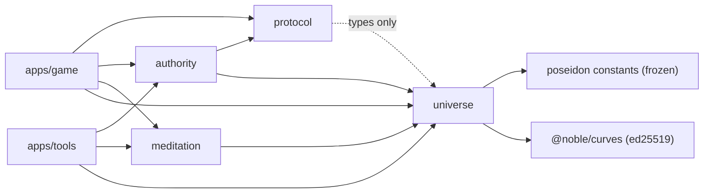
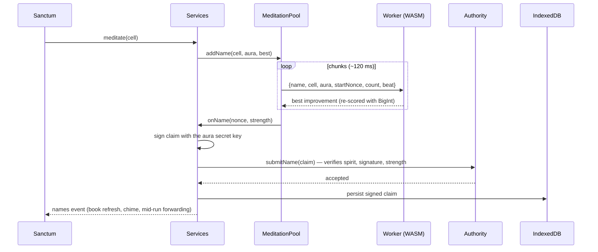
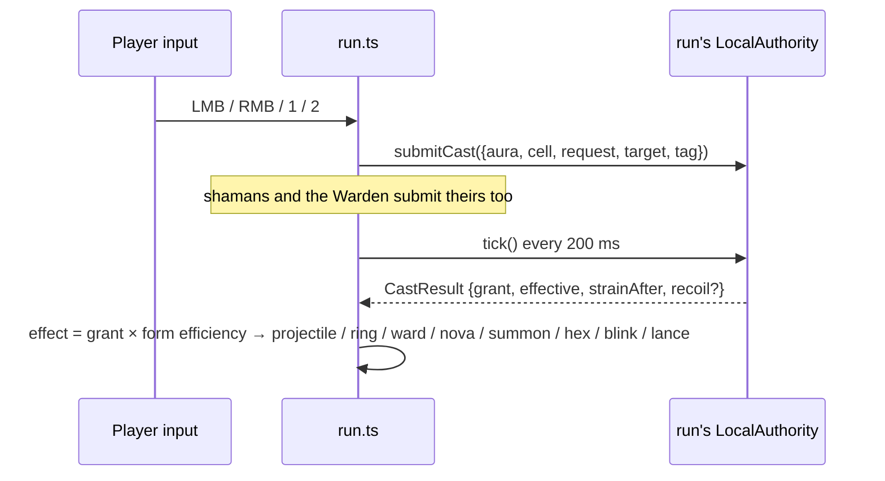

# 10 · Architecture (as built)

How the code is actually organized and how data moves through it. [05 · Architecture](05-architecture.md) is the original design; this doc describes the build and notes where it differs.

## Layout
```
truenames/
  packages/
    universe/     pure, deterministic spec v1: cells, Poseidon, spirits, traits, names, claims
    protocol/     shared message types: CastIntent, CastResult, TickResult, PoolInfo, AuraState
    authority/    the rules: pools, water-fill allocation, strain, capacity, backlash, ticks
    meditation/   scry + name-grinding hot loops, worker body, MeditationPool, WASM Poseidon kernel
  apps/
    game/         Vite + Canvas 2D client (screens, services, save, lore, audio, help)
    tools/        CLI: bench, sim, god-finder, golden vectors, WASM generator, browser vector check
  docs/           design (01–08), as-built (09–10), journal
```
It's a pnpm workspace. Libraries export their TypeScript source directly (`"exports": "./src/index.ts"`), with no build step: Vite, Vitest and tsx consume TS as-is. `tsc --noEmit` is the typecheck.

## Dependency graph

Rules held from [CLAUDE.md](../CLAUDE.md):
1. `universe` is pure and deterministic. It uses BigInt only: no floats in anything that decides existence, magnitude, traits or strength, and no `Math.random` or `Date`.
2. The universe spec is frozen. Golden vectors refuse to regenerate.
3. Vectors pass in Node and in a browser worker (`pnpm test`, `pnpm test:browser`).
4. The authority is an interface, and game code only talks to it through `Authority` / `NpcAuthority`.
5. Name verification goes through `NameVerifier` (`ClearTextVerifier` today).
6. Authority tunables live in `packages/authority/src/tunables.ts`. Game-side balance lives in `apps/game/src/balance.ts`.

## packages/universe
One file of rules plus a fast Poseidon.
- `index.ts` holds the spec v1 functions: `bits`, `target`, `cellDigest` (chained, prefix-memoized), `region`, `spiritAt` / `spiritFromDigest`, `decodeTraits`, `auraField`, `nameHash` / `nameStrength`, `signNameClaim` / `verifyNameClaim`, and the constants (`SEED`, `MIN_SPIRIT_DEPTH = 6`, `MIN_NAME_BITS = 12`).
- `poseidon.ts` is a straight-line Poseidon over frozen constants (`poseidon-constants.ts`, extracted from poseidon-lite). It's bit-identical to poseidon-lite, and a test enforces that.
- `test/vectors.json` holds the golden vectors (never regenerated). `test/run-vectors.ts` is the environment-neutral runner used by both Node and the browser.

## packages/authority
`LocalAuthority implements NpcAuthority` (which `extends Authority`):
```ts
registerAura(pub)   submitName(claim) → {accepted, strength}   submitCast(intent)
tick() → TickResult   auraState(aura)   nameBook(aura)   poolInfo(cell)   currentTick()
grantSyntheticName(aura, cell, strength)   forgetAura(aura)      // NPC seam
```
- **Tick** (`TICK_MS = 200`):
  1. Decay strain.
  2. Group queued casts by spirit (one per aura per spirit per tick).
  3. Lazily refill each pool.
  4. Compute effective = strength + bonus − strain.
  5. **Water-fill** the pool (`allocate.ts`: weights 2^effective, each caster limited by min(request, cap)).
  6. Add strain.
  7. Roll backlash on a seeded PRNG.
  8. Emit `CastResult`s.
- **Pools** are created lazily at full level; refill is computed on read. Untouched spirits cost nothing.
- **Capacity** is derived from the name book and cached per aura.
- Pure functions exported for clients and tools: `spiritStats`, `castCap`, `castStrain`, `familiarity`, `capacityOf`.

## packages/meditation
- **`scan.ts`**:
  - `scanRange(prefix, extra, start, count, onHit, kernel?)` walks cells in index (Z) order with a digest stack. Consecutive siblings cost ~1.14 child hashes plus one spirit hash.
  - `grindName(digest, aura, start, count, beat, onBest, kernel?)`.
- **`worker-body.ts`**: `installWorker(self)` answers `WorkChunk` messages. It loads the WASM kernel once, self-tests it against BigInt Poseidon, and falls back to BigInt on failure. Failed chunks are reported back with their range.
- **`pool.ts` (`MeditationPool`)** runs N workers (hardwareConcurrency − 1) and hands out **small chunks** (~120 ms, sized adaptively):
  - **Weighted fair scheduling**: the task with the least `sent / weight` goes next. Focus = weight 4.
  - **Scry tasks** keep a *contiguous frontier* (`doneUpTo`) even though chunks finish out of order. Failed ranges go on a retry list. `extendScry` widens a running task without disturbing in-flight chunks.
  - **Name tasks** start at a random 64-bit nonce and report only improvements.
  - Control: `setActive(n)` (voices), `setPaused`, `rate()` (utterances/s over 3 s).
- **`wasm/`**: the Poseidon kernel.
  - **Generation**: `apps/tools/src/gen-wasm.ts` *generates* the WAT (8×32-bit-limb Montgomery CIOS multiply, fully unrolled), compiles it with `wabt`, and embeds it as base64 in `kernel-bytes.ts`.
  - **Optimization**: `kernel.ts` derives **optimized Poseidon constants** at load: partial-round constants are folded to one scalar, and each partial mix is factored into sparse matrices (Poseidon paper, appendix B).
  - **Trust**: it's an accelerator only. Candidate scry hits are recomputed by the universe, and name improvements are re-scored with BigInt before being reported.

## apps/game
```
main.ts           boot: load save → Services → screens; the rAF loop; audio wake; tooltips; idle summary
services.ts       long-lived: save, MeditationPool, session authority, event emitters (finds, names, scry, hum)
save.ts           IndexedDB persistence (one record), aura keypair, claim signing, 6→4 slot migration
screens/
  title.ts        title, element choice, attunement (a real grind on the hearth-god)
  sanctum.ts      top bar, guidance, scrying panel, loadout, timers, drag-to-bind
  codex.ts        the Name Book: tabs, filters, sorts, compact paginated rows
  spirit-card.ts  per-spirit card
  chart.ts        Chart of the astral (coverage per element × aspect × depth)
  run.ts          the dark: world, waves, enemies, Warden, forms, HUD, hover regions
lore.ts           names, aspects, traditions, forms, tempers, `truths()`, the ancients
sigil.ts          procedural seals from flavor bits (cached canvases)
help.ts           HELP dictionary + one shared tooltip (DOM `data-tip` and canvas HUD)
audio.ts          synthesized WebAudio (drone, casts, finds, chimes)
balance.ts        game-side balance: enemies, waves, forms, descents, Warden, SLOTS
astral.ts         menu backdrop
meditation.worker.ts / vectors.worker.ts   worker entry points
```
**Screens** implement `{ mount(ui), unmount(), frame?(dt, ctx, w, h) }`. `main.ts` owns the canvas and the requestAnimationFrame loop. The run draws its own frame, and other screens get the astral backdrop. `Services` outlives every screen, which is why meditation never pauses.

## Life of a name

The save stores **signed claims**, not bare numbers. On boot and at the start of each run they're re-submitted and re-verified, exactly as they would be to a server.

## Life of a cast

Each run builds its **own** `LocalAuthority`, so pools and strain are per run, and re-submits your claims. Enemy casters get synthetic names through `grantSyntheticName`. Contention is real because everyone goes through the same `allocate()`.

## Persistence
There's one IndexedDB record (`truenames` / `kv` / `save`), written with a 1.5 s debounce. It holds:
- the aura (secret key, public key, element)
- known spirits (wire form, source, when found)
- **signed name claims**
- the scan map (`prefix|depth → frontier`)
- the meditation, focus and scry plans (resumed on boot)
- the 4-slot loadout
- run history, worker count, descent progress
- the codex view

The universe itself is never stored; it's recomputed from the seed. Losing the secret key loses every name, and there's no backup/export yet.

## Testing and tools
| Command | What |
|---|---|
| `corepack pnpm test` | Vitest: golden vectors, fast-Poseidon ≡ poseidon-lite, authority invariants (allocation, spam collapse, contention, capacity, lazy pools), scan/grind equivalence, pool scheduling (out-of-order, extend mid-flight, flaky workers), WASM ≡ BigInt (both kernel modes). |
| `corepack pnpm test:browser` | Serves `vectors.html` with Vite and runs the golden vectors in a headless-Chromium Web Worker (`playwright-core` 1.58.2). |
| `corepack pnpm typecheck` | `tsc --noEmit` over all packages and apps. |
| `corepack pnpm tools bench` / `bench-wasm` | Hash rates, BigInt vs WASM. |
| `corepack pnpm tools sim` | Cadence and contention tables for tuning strain and pools. |
| `corepack pnpm tools god-finder [prefix\|-] [depth]` | Parallel scan of a layer, listing spirits by might. |
| `corepack pnpm tools vectors` | Wrote the golden vectors once; refuses to overwrite. |
| `corepack pnpm tools gen-wasm` | Regenerates the WASM kernel. |

Balance was tuned with scripted Playwright bots playing whole runs at chosen descents (see the journal).

## Extending
- **A new form**: add it to `FORMS` (lore), `formWeight` / `formEfficiency` (tunables), the `switch` in `run.ts: applyPlayerCast`, a sound in `audio.ts: sfxCast`, and `FORM_GLYPH` in `codex.ts`. Trait decoding only has 3 bits (8 forms), so a 9th form needs a spec version bump.
- **A tunable**: authority rules go in `tunables.ts`; run balance goes in `balance.ts`. Never inline numbers.
- **A new screen**: implement `Screen` and call `app.go(screen)`. Use `data-tip` with a `HELP` key for hover help.
- **Player-facing text**: in-world words only. Format truths with `lore.truths(n)`.

## Seams for multiplayer
- `Authority` is already the only way the client touches rules. A `RemoteAuthority` over WebSocket plus a Node server hosting `LocalAuthority` would slot in. The run's local authority could remain for prediction.
- Claims are self-verifying signed records (spec v1 message `truenames/name/v1|cell|nonce`). A server needs no trust in the client, and anyone can grind a name *for* someone else, but only the key holder can submit it.
- `NameVerifier` is the swap point for zero-knowledge proofs later (see [07](07-multiplayer-roadmap.md)).
- **Still local-only today**: enemy NPCs, run pools and strain, and the scan map. A shared world needs decisions on which of those become server state.
